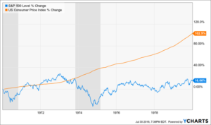
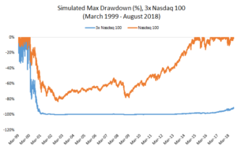
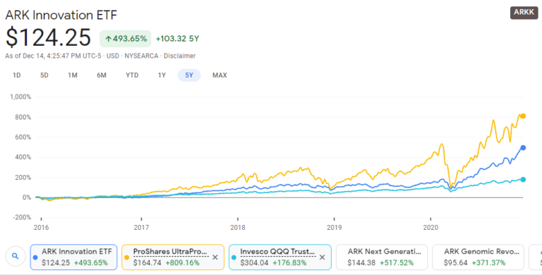

## Two Types of Inflation

People typically just use the word inflation by itself, but there are actually 2 main types and it’s essential to be specific. The 2 types are:

1.  Monetary Inflation – The total amount of money in circulation as primarily defined by the Federal Reserve.
2.  Price Inflation – How much stuff a dollar can buy. This is typically measured by the Consumer Price Index (CPI).

The money supply (monetary inflation) has exploded recently but prices (price inflation) have been relatively stable.

## Inflation is a Hidden Flat Tax on Everyone

Throughout history, governments have used the effective equivalent of [counterfeiting](https://thinkbynumbers.org/economics/when-the-government-prints-new-money-who-gets-it/) in order to subvert the will of the public by funding wars and reward special interests when citizens aren’t willing to pay for them through taxation.

The majority of tax systems are “progressive” in that they tax the rich at a higher percentage than they tax the poor. However, price inflation has the same effect as a flat tax on everyone.

The fact that neoliberals are the staunchest defenders of the Fed’s inflationary policies (flat tax) while being violently opposed to an actual transparent flat tax is mystifying to me.

## The Rate of Inflation

Since the creation of the Federal Reserve in 1913, the US government has printed enough money to wipe out 98% of the value of the dollar.

This inflation tax rate has averaged around [3.2%](https://tradingeconomics.com/united-states/inflation-cpi#:~:text=Inflation%20Rate%20in%20the%20United,percent%20in%20June%20of%201921.) since 1920. However, some years it’s been as high as 20% or as low as -15%.

## Nominal vs Real Values

A real **value** is one that has been adjusted for **inflation**, enabling **comparison** of quantities as if the prices of goods had not changed on average. In contrast, a **nominal value** has not been adjusted for **inflation**, and so changes in **nominal value** reflect at least in part the effect of **inflation**.

## Hedges Against Inflation

For a comparison on what you could do with your money, here are some compound annual growth rates (CAGR) or historical average annual returns from various options.

-   Inflation – 3.2%  
-   Land – 6.3% (4.8% effective CAGR after property taxes)
-   Gold –  4.6%
-   Nasdaq – 9.2%
-   Rental Income – 7% (After expenses)

Note that all of these options have historically beat inflation’s 3.2% over the long term.

## Land as a Hedge

Land has on average beat inflation. Since 1975, the price of land has risen at a 6.3% Compound Annual Growth Rate (CAGR). However, subtracting 1.5% for property taxes would bring it down to 4.8% effect CAGR. 

However, the price of any particular lot or area can swing wildly. For instance, I got an offer for $50k for my lot last year, but I couldn’t accept it because it was attached to my mortgage and hadn’t sold the home yet.  Since I missed that deal, the best offer I’ve gotten in a year is $18k. 

If someone was buying my lot to protect wealth and bought it at $50k a year ago and now could only sell it for $18k, it would be like they lost over 50% on their investment. So when buying land as an investment, it can really pay off to be patient, cheap, and to shop around. Otherwise, one could easily lock in significant losses from the very start by buying at a much higher price than they needed to. 

## Residential Real Estate as a Hedge

Over the last 25 years, the price of the average home value has increased by [3.9%](https://www.ownerly.com/real-estate/average-home-appreciation/) annually.  However, this change can vary [wildly by location](https://www.zillow.com/ozark-mo/home-values/). Depending on the specific tax rates, it’s probably still a little better than gold at 4.6%. 

## Land + Buildings

From the 1950s until 2000 the median home price in the US was about $175k in today’s dollars.  It tracked pretty much identically with inflation. 

However, in 2000, interest rates dropped from 7% to 1% which lead to the housing boom. 

That led to the last housing crash in 2006. There was a 33.3% fall in home prices from 2006 to 2011. Phoenix registered the biggest drop (-54.7%) among the twenty largest metro areas, followed by Miami (-50.5%), Detroit (-43.3%), San Francisco (-40.8%), Los Angeles (-40.1%), and San Diego (-39.7%).

Since then, interest rates have fallen back again to all-time lows pumping up the price of housing again. The reason that low interest rates drive up the price of housing is that they expand the number of buyers that can afford the monthly payments for a given house.  

Inflation will likely soon become a problem.  At that point, the only option is to increase interest rates like in the 70s and in 2006.  Long periods of low interest rates spurring housing production leading to an abundance of houses. Then when interest rates are increased, the number of buyers that can afford them shrinks leading to a crash in prices.  

Interest rates are currently at all-time lows and housing prices are at inflation-adjusted all-time highs. Interest rates will have to increase eventually to prevent hyperinflation. Thus it appears very likely that we’ll see a similar crash in housing prices as we saw in 2007.

One could experience major losses by getting in at what may be the top of the current bubble. Hence, it might be profitable to wait for a crash in housing prices. But if the government never stops printing money and turns the US into a hyperinflationary Zimbabwe, prices never will go down. So if you think that’s a realistic scenario, you may as well just do the buy any time now. 

## New Residential Real Estate Development as a Hedge

The median price for an existing home is currently [$223k](https://www.realtor.com/advice/buy/is-it-cheaper-to-buy-or-build-a-house/).  The median cost to build a new home is [$290k](https://www.realtor.com/advice/buy/is-it-cheaper-to-buy-or-build-a-house/).  So that means it generally costs 30% more to build a new home than buy an existing one.  Maybe one of the reasons people are willing to pay an extra 30% is for the luxury of complete creative control over every aspect of their home. It may also be similar to the way a new car loses thousands of dollars in value the minute you drive it off the lot. 

So if one is buying a home as an investment property, it seems like building a new home instead of buying an existing one could effectively be locking in an immediate loss of 30% on their investment. 

## Rental Property as a Hedge

Annual rent from a property is about 13% of the property value per year. The annual expenses as a percentage of the home value are:

-   Insurance 2.24%
-   Property Taxes 2.31%
-   Maintenance 1%
-   **5.5% Total Expenses**

So the average net return from rentals is 7.5% (13% income – 5.5% expenses). If you hire a management company, they take 10% of the rent, so that would bring the net return down to 6.5% per year. 

## Stock Market as a Hedge

The overall S&P may suck over the next decade if the 2020s end up being a repeat of the stagflation of the 1970s. Over the entire decade of the 1970s, inflation climbed 103% compared to only 16% for the S&P 500, excluding dividends. 

Even though the broad S&P sucked, technology stocks like those in QQQ could be immune and vastly beat inflation.  For example, Intel grew 1230% during the ’70s despite stagflation.  This may be true because new technologies offer companies ways to cut costs which they can be forced to adopt to ensure their survival during economically desperate times.

Hedging one’s bets by diversifying into physical commodities like gold or real estate can be wise as a form of insurance.  However, I think the reasons that the stock market has historically significantly outperformed gold/land will remain true. The main reasons the value of the stock market grows faster are

-   Technological innovations making it possible to produce more widgets with the same amount of input resources
-   Process efficiency innovations making it possible to produce more widgets with the same amount of input resources

These facts are going to remain true and likely continue to accelerate themselves as new technological innovations make it easier to produce more new technological innovations.

Specific ETFs that look good in the tech sector are QQQ for the risk averse and it’s 3X leveraged cousin TQQQ. TQQQ grows 3X faster than QQQ but you have the potential of losing your entire investment. TQQQ was created in 2010. However, if it had existing in 2000 and one bought it then, after 20 years, you’d still only have about 9% of your initial investment.

If one wanted to achieve gains closer to TQQQ but with less risk, they might consider the non-leveraged ARK Innovation ETF. It’s 5X return over the last 5 years is between TQQQ’s 9X return and QQQ’s 3X return. Yet, you can see in the chart below that it’s volatility has been dramatically lower than that of TQQQ.

##### Wall St. Owns Congress and Congress Owns Wall St.

Furthermore, Wall St shovels millions into the campaigns of [both parties](https://www.npr.org/2020/08/17/902626429/wall-streets-big-money-is-betting-on-biden-and-democrats-in-2020).  And the majority of congress are millionaires in the top 10%. The majority of the 10%’s wealth is in the stock market. 

[From Visual Capitalist](https://www.visualcapitalist.com/5-undeniable-long-term-trends-shaping-societys-future/)

Since the government continues to accrue more and more power, they’ll probably continue to use that power to endlessly bail out Wall St. into oblivion in order to protect their own savings. This further suggests that stock in innovation companies will likely still be a good inflation protector.

## Conclusion

Based on all that, my humble opinion is that if one wanted to diversify outside the stock market into real estate, the best options would be:

1.  Land – Look around for good deals on plain old land and let it grow at 5% a year
2.  Existing Homes as Rentals – Look around for good deals on existing homes use as rental properties and make around 7% a year in rental income
3.  Bleeding Edge Technology ETFs like [ARK](https://www.google.com/finance/quote/ARKK:NYSEARCA?sa=X&ved=2ahUKEwju1uintM7tAhXjdc0KHaJwDdUQ3ecFMAB6BAgBEBk&comparison=NASDAQ%3ATQQQ%2CNASDAQ%3AQQQ)