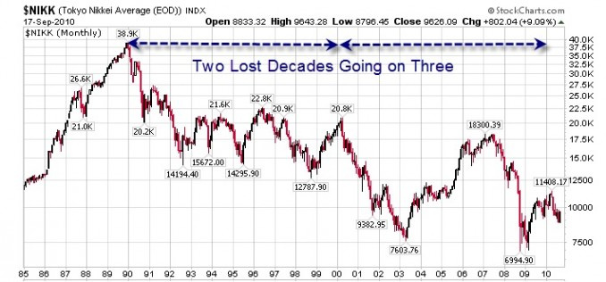

Much of the massive amount of new money the Fed is printing is going into Zombie Companies.

## How Zombie Companies Survive

Zombie Companies are firms that don’t survive by producing value for their customers. Instead, they survive by parasitically draining resources from the overall economy by borrowing at near 0% interest from the Federal Reserve. The Federal Reserve just creates this money out of thin air.

## How this Harms Everyone

So this borrowing has the same negative effect on everyone’s paycheck purchasing power as criminal counterfeiters do. Instead of consumers having the power to support businesses that do provide valuable goods and services, the Fed effectively steals that money from consumers and gives it directly to corporations without them having to produce value for consumers.

### Stolen Productivity Gains

Productivity gains allow the government to do this without increasing the consumer price inflation too much. In the first half of the 20th century, the financial benefits of technological innovation and productivity gains were generally evenly enjoyed by society. Since the end of the gold standard, all of the benefits are now [funnelled](https://thinkbynumbers.org/economics/4-trillion-printed-in-2020-went-entirely-to-the-top-1-percent/) to those with the most effective Washington lobbyists.

## Immediate Effects on the Stock Market

The immediate effect of dumping money into corporations is that their stock value rises. You can see this in the recent explosive growth in the US stock market. However, it can’t go on forever, because it would lead to catastrophic hyperinflation as seen many times throughout history and most recently in Venezuela.

## Long-Term Effect of Sustaining Zombie Companies

You can see the long-term fallout in Japan’s “Lost Decade”. Japanese banks continued to support weak or failing firms. The result was three decades of poor economic growth.

## Long-Term Effect of Killing Zombie Companies

This effect can also be seen in the Stagflation of the 1970s. The US abandoned the Gold Standard in 1972 allowing the Federal Reserve to print as much as they wanted. What followed was almost no economic growth for a decade and a 17X explosion in the price of gold relative to the dollar. Then Jimmy Carter appointed Paul Volker the chairman of the Fed. Volker had a will of steel required to force America to endure the short-term pain of increasing interest rates. This pain took the form of massive unemployment as zombie companies went bankrupt or were forced to restructure to live within their means. However, the long-term result was two decades of great stock market performance through the ’80s and ’90s.

## Possible Future Scenarios

Based on all past periods of massive monetary supply inflation like this, it’s very likely the US will eventually reach a point where the bubble pops and there’s a stock market crash.

### Pre-Crash Strategy

Ideally, you’d have the Federal Reserve and Wall Street’s insider information that would help you predict the timing of the crash and get out in advance. Then you could keep enjoying the amazing returns from the bubble as long as possible. However, for the rest of us, the best we can probably do is put our money in precious metals ETF’s to be protected from these losses.

### Post-Crash Scenarios

#### 1\. Fed Responsibly Raises Interest Rates

If the Federal Reserve begins behaving responsibly at that point, they would raise interest rates and force all the [zombie companies](https://www.federalreserve.gov/econres/notes/feds-notes/us-zombie-firms-how-many-and-how-consequential-20210730.htm) to go bankrupt or restructure to begin surviving by providing value and earning money. This was the approach of Fed Chairman Paul Volker in 1979. Higher interest rates will temporarily increase unemployment and make the stock market sharply fall even more in the short term. However, after this correction, it will great opportunity to sell your gold ETF’s get back into the stock market at the bottom and enjoy significant future growth.

#### 2\. Fed Continues Low-Interest Rate Policy

This was the approach of Japan in the ’90s. The [zombie companies](https://www.federalreserve.gov/econres/notes/feds-notes/us-zombie-firms-how-many-and-how-consequential-20210730.htm) were kept on life-support. The result was that it took 3 decades for the market to get back where it was before the crash. Given that it’s unlikely anyone has the political will to cause the short-term pain of higher interest rates, this seems like the most likely scenario.

The best investment approach at this point is more complicated. You don’t really want to buy any general index funds like the Dow or S&P. Over the entire decade of the 1970s, inflation climbed 103% compared to only 16% for the S&P 500. 

However, may be able to find good companies or sectors that are more likely to outperform the overall market. For example, Intel grew 1230% during the ’70s despite stagflation.  This may be true because new technologies offer companies ways to cut costs which they can be forced to adopt to ensure their survival during economically desperate times.

You would have done even better just sticking with gold throughout the ’70s and enjoyed a 1700% return if you sold it as soon as Paul Volker started raising interest rates.

## Why It’s Different This Time

You might say that a coming market crash (if it even happens) will be like the more recent corrections that just turn around in a few months and everything’s fine. However, in the past, the Fed had the ability to address them by just lowering interest rates and jacking up the money supply. The difference this time is that rates are already near 0% and we’ve got significant inflation already.

The recent spike in the money supply has been unprecedented.

So they’ve already used up most of the ammunition they normally have to deal with financial crises like the one we saw in 2008.

This also means the recovery is likely going to be nothing like the amazing one we saw in 2020 after the coronavirus crash. That crash seems like a once in a lifetime buying opportunity. The depth of the crash was caused by mass hysteria and uncertainty driving stock prices irrationally low. That was immediately followed by a once in a lifetime explosion in the money supply that pumped the stock prices far higher than they started.

Why I Might Be Wrong

> The **[technological singularity](https://en.wikipedia.org/wiki/Technological_singularity)**—or simply the **singularity**—is a [hypothetical](https://en.wikipedia.org/wiki/Hypothetical) point in time at which technological growth becomes uncontrollable and irreversible, resulting in unforeseeable changes to human civilization. According to the most popular version of the singularity hypothesis, called [intelligence explosion](https://en.wikipedia.org/wiki/Technological_singularity#Intelligence_explosion), an upgradable [intelligent agent](https://en.wikipedia.org/wiki/Intelligent_agent) will eventually enter a “runaway reaction” of self-improvement cycles, each new and more intelligent generation appearing more and more rapidly, causing an “explosion” in intelligence and resulting in a powerful [superintelligence](https://en.wikipedia.org/wiki/Superintelligence) that qualitatively far surpasses all [human intelligence](https://en.wikipedia.org/wiki/Human_intelligence).
> 
> <cite><a href="https://en.wikipedia.org/wiki/Technological_singularity">https://en.wikipedia.org/wiki/Technological_singularity</a></cite>

At some point in the future, it seems like there’s going to be a snowball of technological advancement where everything is automated and all the idiot human workers are replaced by superior automation.  At that point, I think leveraged technology index funds like TQQQ are going to explode to infinity.  In that case, I would feel like an idiot with my relatively worthless gold. But if that happens, we’ll be living in a utopia anyway, so I probably won’t be too worried about it.