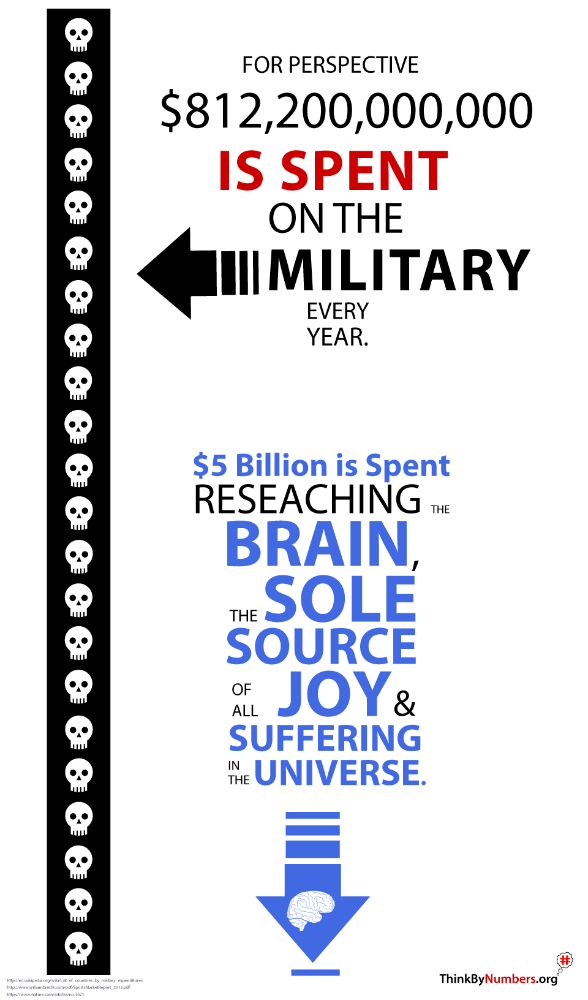

Guess what holds the solution to every problem in the world? It’s the human brain!

# Your brain is dying.

After age 20, you lose about a gram of brain mass or [70 million](https://www.ninds.nih.gov/Disorders/Patient-Caregiver-Education/Life-and-Death-Neuron) brain cells every year! Multiply that by the [7.7 billion](http://www.worldometers.info/world-population/) people in the world, and it comes out to [54,000,000,000,000,000](https://www.ninds.nih.gov/Disorders/Patient-Caregiver-Education/Life-and-Death-Neuron) brain cells lost every year. That’s a pretty big number! So to put that in perspective, just imagine one brain cell [54,000,000,000,000,000](https://www.ninds.nih.gov/Disorders/Patient-Caregiver-Education/Life-and-Death-Neuron) times. 😋

## Fewer Brain Cells, Mo’ Problems

This natural brain rotting means we have [54 quadrillion](https://www.ninds.nih.gov/Disorders/Patient-Caregiver-Education/Life-and-Death-Neuron) fewer brain cells to solve problems like:

-   Cancer, aids, cystic fibrosis, heart disease, and other chronic illnesses
-   Climate change and the destruction of nature
-   Wars and terrorism
-   Poverty, starvation, and unemployment
-   Government corruption

On top of the fact that your brain is naturally rotting, brain diseases also impose massive costs on the economy.

# Insane in the Membrane

[_3 people_](https://en.wikipedia.org/wiki/Suicide) _will have killed themselves in the time it takes to read this article. (Hopefully, not as a result of reading this article.)_

[1 in 4](https://www.who.int/whr/2001/media_centre/press_release/en/) of your friends and loved ones are suffering from a mental illness like depression, bipolar disorder, or schizophrenia. It’s also expensive as hell. Here’s your bill for the year:

-   Direct Medical Costs = [$150 Billion](https://www.ncbi.nlm.nih.gov/pmc/articles/PMC5007565/)
-   Incarceration of the Mentally Ill = [$35 Billion](https://www.ncbi.nlm.nih.gov/pmc/articles/PMC5007565/)
-   Social Services for the Mentally Ill = [$150 Billion](https://www.ncbi.nlm.nih.gov/pmc/articles/PMC5007565/)
-   Lost Productivity and Absenteeism = [$468 Billion](https://www.ncbi.nlm.nih.gov/pmc/articles/PMC5007565/)

**That all comes out to** [**$803,346,862,554.63**](https://www.ncbi.nlm.nih.gov/pmc/articles/PMC5007565/)**.** Don’t forget to tip your server.

Also, I forgot to mention the [800,000](https://en.wikipedia.org/wiki/Suicide) people that will commit suicide this year, further reducing our global problem-solving brain cell pool by [80,000,000,000,000,000](https://www.ninds.nih.gov/Disorders/Patient-Caregiver-Education/Life-and-Death-Neuron) brain cells.

# Alzheimer’s Disease

Alzheimer’s disease is the leading cause of unsubstantiated claims that nurses stealing your jewelry and trying to poison you.

## The Magnitude of Alzheimer’s Disease

1.  [35.6 million](https://www.alz.org/alzheimers-dementia/facts-figures) people suffer from Alzheimer’s disease.
2.  Also, [35.6 million](https://www.alz.org/alzheimers-dementia/facts-figures) people suffer from Alzheimer’s disease.
3.  Also, have I ever told you about how [35.6 million](https://www.alz.org/alzheimers-dementia/facts-figures) people suffer from Alzheimer’s disease?

This [35.6 million](https://www.alz.org/alzheimers-dementia/facts-figures) will very likely include you or a parent or grandparent at some point.

## The Financial Cost of Alzheimer’s Disease

[$604 billion](https://www.forbes.com/sites/brucejapsen/2018/03/20/alzheimers-costs-reach-277-billion/) per year including:

-   medical costs
-   the cost of formal
-   informal care

# What are we doing to fix our broken brains?

So, as you can see, we’re spending trillions of dollars dealing with the **consequences** of our flawed or malfunctioning minds. One would think that we’re making similar efforts to **prevent** or find solutions to the **root causes** of these neurological failures.

**Wrong!**

# Disproportionate Resource Allocation

This is just one of many examples of the reason why our neurological problems keep **getting worse** every year instead of better.

There’s a [**1 in 20,000,000**](https://thinkbynumbers.org/government-spending/false-sense-of-insecurity/) chance you’ll be killed in a **terrorist attack**.

There’s a [**1 in 10**](https://www.alz.org/alzheimers-dementia/facts-figures) **chance** you will die with **Alzheimer’s disease**.

However, we spend [**162 times**](https://en.wikipedia.org/wiki/Military_budget_of_the_United_States) **more on the military than brain research** in order to prevent a threat that’s [**2 million**](https://thinkbynumbers.org/government-spending/false-sense-of-insecurity/) **times less likely** to affect you.

Obviously, **a single death from terrorism is too many**. However, we do not have infinite resources. We simply have to do a cost-benefit analysis and allocate our limited resources in proportion to the threat if we actually want to reduce suffering in the world.

# Protect and Promote the General Welfare

The official purpose of government is to promote and protect the **general** welfare. Unfortunately, in reality, the government very often does the exact opposite. It **reduces** the **general** welfare by taxing the general public and funneling their wealth to special interests and corporations large enough and immoral enough to hire lobbyists. So its actual function is to promote and protect the **specific welfare** of these special interests and only the most wealthy and greedy fraction of corporations.

## The Primary Cause of Disproportionate Spending: Lobbying

For every single member of Congress, there are more than [23](http://www.facethefactsusa.org/facts/power-numbers-lobbyists-have-congress-covered/) lobbyists whose full-time job is to badger that single congressperson into giving some corporation or special interest organization money through sweetheart contracts or subsidies.

It’s only rational for special interests to make this investment. For every dollar spent on influencing politics, the nation’s most politically active corporations received [$760](https://sunlightfoundation.com/2014/11/17/fixed-fortunes-biggest-corporate-political-interests-spend-billions-get-trillions/) from the government. That’s an average 76,000% return on investment compared to the [11%](https://www.thesimpledollar.com/where-does-7-come-from-when-it-comes-to-long-term-stock-returns/) you’ll get from the stock market.

# Unrepresentative Democracy

The result of this is nothing less than the complete transfer of power from the citizenry to special interests. In a truly representative democracy, the more public support there is for a policy, the more likely it would be to become law.

However, in reality, public support has almost no influence on what laws are passed. Whether there is [0% or 100%](https://scholar.princeton.edu/sites/default/files/mgilens/files/gilens_and_page_2014_-testing_theories_of_american_politics.doc.pdf) support for a policy, there’s a [30% likelihood](https://scholar.princeton.edu/sites/default/files/mgilens/files/gilens_and_page_2014_-testing_theories_of_american_politics.doc.pdf) that it will become law.

# The Solution: A Government Exchange Policy

Buckminster Fuller said that when trying to change something, instead of going up against it, create something new that makes the problem obsolete. The solution is to have the government issue everyone a receipt with an exchange policy.

Every citizen should have access to a shopping cart showing what their share of public resources will be spent on. They should have the ability to adjust their allocation as they see fit.

It’s important to recognize that our resources are finite, so it’s good to have an increase in one area automatically decrease resources in another area. Here’s a crude prototype that you’re welcome to fork and improve:

\[codepen\_embed height=”432.5″ default\_tab=”html,result” slug\_hash=”xygVog” user=”mikepsinn”\]See the Pen[  
Crowdsourced Federal Budget Allocation](https://codepen.io/mikepsinn/pen/xygVog) by Mike P. Sinn ([@mikepsinn](https://codepen.io/mikepsinn))  
on [CodePen](https://codepen.io).\[/codepen\_embed\]

Do you have any ideas about how to optimize societal resource allocation? Please share them in the comments!