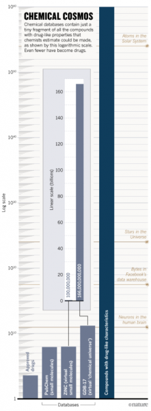

# What We Don't Know

You're only 2 lifetimes away from George Washington. Modern scientific medicine is newer than your country. It's been applied for 0.0001% of human history. That's like reading the first sentence of a book and thinking you understand the plot. Except the book is 10,000 pages long and you're still on page 1.

There are [7,000 known diseases](https://www.washingtonpost.com/news/fact-checker/wp/2016/11/17/are-there-really-10000-diseases-and-500-cures/) afflicting humans. "Known diseases" means diseases we've bothered to name and categorize. There might be more, but if we haven't named them yet, they don't count. Naming things is how science works.

There are as many untested compounds with drug-like properties as there are [atoms in the solar system](https://www.nature.com/articles/549445a) (166 billion). Atoms in the solar system is a lot of atoms. For scale, if you counted one atom per second, it would take you 5,265 years to count them all. But you'd die after about 80 years, so you'd need a team. A very large team.

Here's the math:
- 166 billion potential drug molecules
- × 7,000 diseases
- = 1,162,000,000,000,000 possible combinations to test

That's one quadrillion one hundred sixty-two trillion combinations. A quadrillion is called that because it comes after a trillion, and scientists ran out of creative names. They just add "quad" because there are four sets of three zeros. Naming large numbers is easier than actually comprehending them.

So far, you've studied [21,000 compounds](https://www.centerwatch.com/articles/12702-new-mit-study-puts-clinical-research-success-rate-at-14-percent).

21,000 ÷ 1,162,000,000,000,000 = 0.000000002%

You know 0.000000002% of what there is to know about treating disease. You've tested roughly as much as you haven't tested, if you round to the nearest 100%. The rounding error is larger than all of human medical knowledge. This should concern you.

Every clinical research study ends with "more research is needed." This is because you know basically nothing. But instead of speeding up research, you made it slower and more expensive. It's like using a calculator to hammer nails. Technically possible, but not what the calculator was designed for.

You're at the beginning of thousands of years of systematic discovery, but you're crawling when you could be running. The current method of clinical research is designed to be cautious, not fast. Cautious is great if you're immortal. You're not. Your cells are dying right now. Some of them are cancer. You don't have time to be this careful.

If you test one combination per day, it will take 3.2 billion years to test them all. For context, the Earth is 4.5 billion years old. You'll need to start soon and also invent time travel.

Here's how to speed this up: collect real-world data from actual patients trying actual treatments. Let doctors and patients track what works. Stop requiring everyone to wait 10 years and spend $1 billion to test each combination. The alternative is to continue at the current pace, which means humanity will go extinct from natural causes before finishing the research.

[CureDAO](https://curedao.org/) is building this system. A decentralized platform to discover what actually works by collecting data from millions of people trying millions of treatments. You can help build it, or you can wait another 500 years to test the remaining 1,162,000,000,000,000 combinations one at a time. Your great-great-great-great-great-great-great-great-great-great-great-great-great-great-great-great grandchildren will appreciate your patience.
